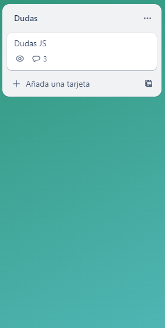
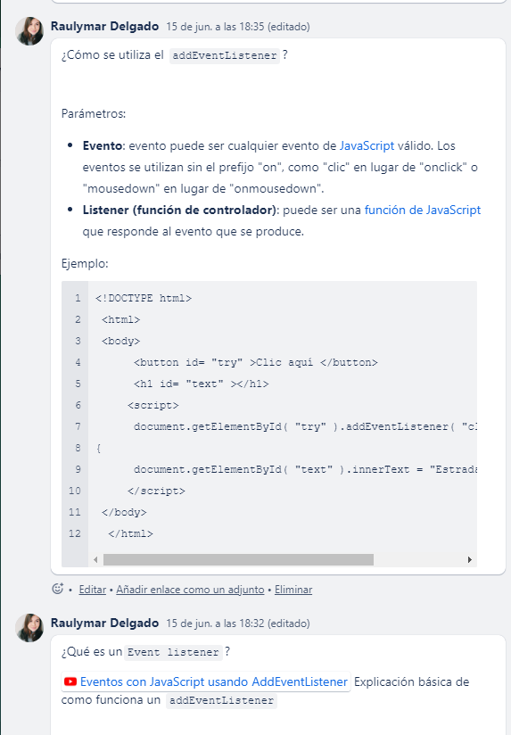
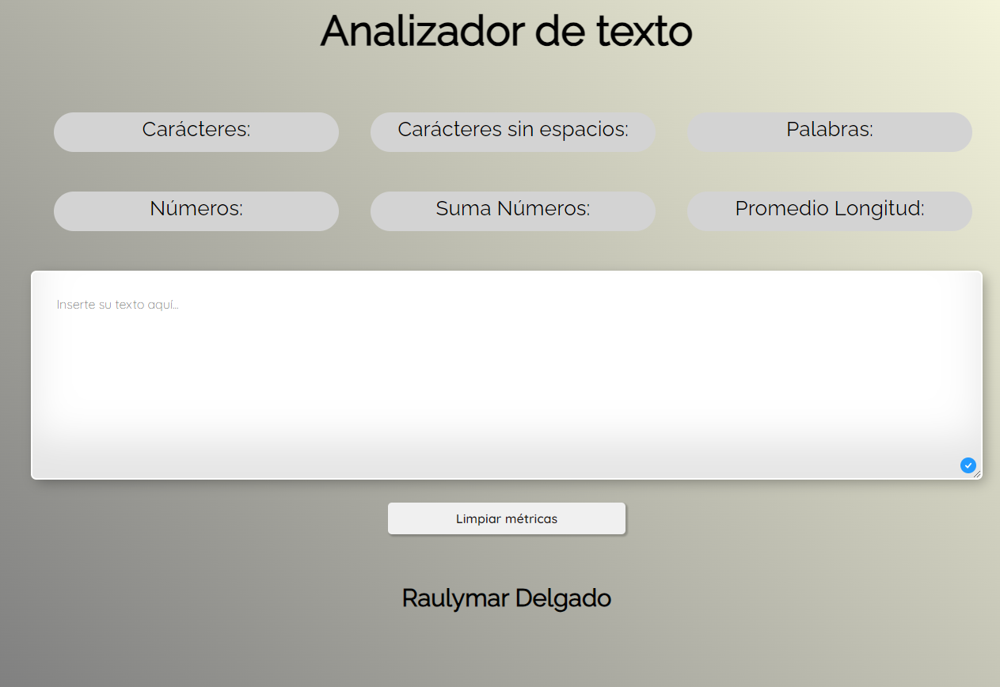

# Text Analyzer by Rau Delgado

Aquí les contaré un poco sobre mi proceso para el proyecto de Text Analyzer

## Índice

* [1. Contexto](#1-contexto)
* [2. Proceso](#2-proceso)
* [3. Decisiones del proyecto](#3-decisiones-del-proyecto)
* [4. Ayudas finales + Test](#4-ayudas-finales-+-test)
* [Authors](#5-authors)

## 1. Contexto

**Empecemos conociendo un poco sobre el analizador de texto, y para quién es útil.**

Es una herramienta que permite analizar un texto contando el número de frases, palabras y caracteres presentes. También proporciona información estadística sobre la repetición de frases y palabras clave. 

Esto viene a ser útil para cualquier tipo de escritor (autor, periodista, estudiante, etc.), quienes escriben textos con un determinado número mínimo y/o máximo de palabras.

También es útil para profesores, quienes lo usan para evaluar el nivel de dificultad y la habilidad requerida para comprender un texto. Finalmente también encontramos a los editores web, quienes lo usan como herramienta para así optimizar el contenido de una página web al saber en un solo clic qué expresiones y palabras clave son las más utilizadas.

 
## 2. Proceso

* *Organización* 

    Para mi, el organizarme al principio no fue nada demasiado complicado, utilicé Trello, donde me asignaba tareas por items, y luego las iba pasando a otras columnas. 

    Luego de unos días quise incorporar otra herramienta, más que todo para unir mis tareas diarias junto a las de Laboratoria, ahí es donde entró Notion. 

* *Primeros Pasos*
    
    Lo que me ayudó un montón fue leer el  `README` una y otra vez para así comprender mucho más qué era lo que se me pedía, entonces ahí fue que empecé por lo primero: preparar mi PC. 

    Luego de esto, pasé con mi prototipo de baja fidelidad, en mi mente lo tenía bien claro y esperaba lograr algo netamente parecido. 
    

* *¿Por dónde empiezo?*
    
    En mi caso fue ideal empezar por lo más sencillo (desde mi punto de vista), que era el HTML, luego procedí a conectar al CSS para que así ya pudiese de cierta forma 'adelantarme'. 

* **BLOQUEOS 🆘**

    No contaba con que el JavaScript sería un poco difícil al principio, no sabía por donde empezar, **¿el index o el analyzer primero?**, así qué básicamente hice lo que pude. 

    Bloquearme. 

    
    El bloqueo me duró casi una semana, en la que avancé con otras actividades, entre ellas el organizarme e investigar un montón. 

* *¿Cómo salí de esto?*
    
    Muy aparte de lo que investigué y pude entender, mis compañeras fueron importante en este proceso, me acompañaron y además, fueron una guía cuando no veía soluciones, solo problemas. 

En todo este proceso, me fue absurdamente necesario el fallar y equivocarme, hasta agradezco el bloqueo, pues sin ello me habría sido muy difícil continuar con cada reto que se me presentó. 

## 3. Decisiones del proyecto

Mi guía predilecta fue el `readme`, lo leí muy bien, y cuando no entendía volvía e investigaba. De hecho en mi `Trello` ubiqué una columna en la que podía escribir las dudas que tenía + recursos que me ayudaron a entender. 

Una de las muchas dudas o decisiones que tuve que tomar fue el utilizar un `type`en el button, al principio me guié según un recurso encontrado, y la manera de hacerlo era con `form` y `type`, pero luego del primer sprint me di cuenta que mis compañeras lo habían utilizado de otras formas. 

Creando el button y haciéndolo funcionar desde JavaScript, cosa que yo no hacía todavía. Por lo que me fui a mi index y empecé con ese proceso, al principio, aunque corría, me salía un error de tipo 404. 

Luego entendí que era por un form que no había quitado, y corrió perfectamente. 

Las funciones me sacaron un poco de canas verdes, aunque cuando inicié la primera function se volvió todo más fácil. 

## 4. Ayudas finales + Test

Finalmente, luego de una OH con David, y varias reuniones con mi squad, quienes me ayudaron a aclarar un poco hacia donde dirigirme, pude concretar el proyecto de esta forma. 

Aunque el `npm run test:e2e` me dio dolores de cabeza, gracias a un comentario en mi Daily pude concretar mi proyecto con éxito. 

Me siento feliz con lo que hice, y orgullosa, aunque sé que hay muchas cosas más por reforzar, entre ellas, el JavaScript y parte de CSS, pero sé que paso a paso lo lograré. 

-[Click aquí](https://raudelgado.github.io/DEV009-text-analyzer/src/)

## Authors

- [@raudelgado](https://github.com/raudelgado)

[def]: imagenes/Recurso%2PROTOTIPO.png